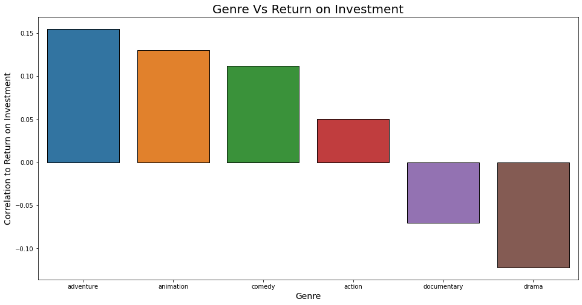
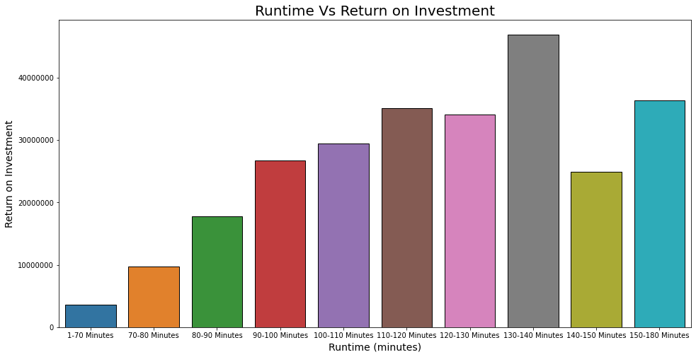
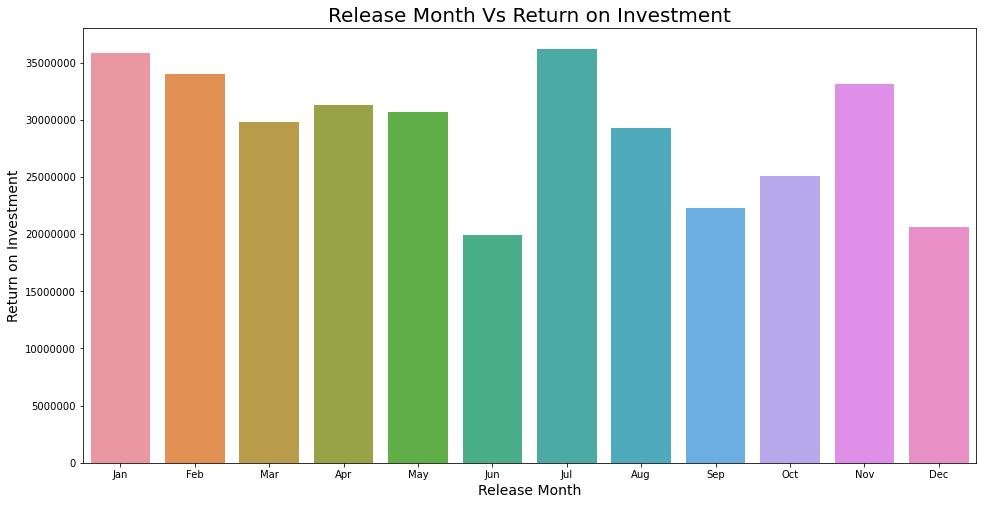

# Movie Analysis Project
**Author:** Kai Uechi

## Overview
***
This project is an analysis of movie data to find what types of movies are most profitable. The analysis shows that a film's release month, runtime, and genre correlate to its return on investment. Using this analysis, Microsoft's movie studio can focus on creating animated adventure films between 130-140 minutes long to release in either January or July. These films are likely to be more profitable.

## Business Problem
***
Microsoft's new movie studio needs to decide on what type of films to create. By analyzing what films are currently performing well, the studio can focus its resources into films that are likely to have the highest return. Using movie data from several sources, I examine how genre, runtime, and time of release affects a film's return on investment.

## Data
***
This project uses data from several sources: IMDB (supplying runtime and genre), Box Office Mojo (supplying financial data), and The Numbers (supplying additional financial data, release date, and production budget).

## Methods
***
The data from these sources has been joined together and trimmed of the many movies that lacked financial data, since such data points are useless in the context of this analysis. Additionally, duplicates and outliers have been removed from the data set.

## Results
***
### Genre Vs Return on Investment

Most genres have little correlation with a film's return on investment, but several categories stand out:
* Adventure
* Animation
* Comedy
* Drama

### Runtime Vs Return on Investment

Most movies last between 75 to 125 minutes, and longer movies tend to have better returns.
However, this trend stops past the 140 minute mark.

### Release Month Vs Return on Investment

Most movies tend to release near the end of the year, especially in October and December.
However, the average return on investment is highest in January and July.

## Conclusions
***
Three main points can be concluded from this analysis:
* **Adventure, Animation, and Comedy films should be prioritized.** Additionally, Drama and Documentary films should be avoided. Genres besides these have little impact on a film's return on investment.
* **Films should aim to have a runtime of between 130-140 minutes.** A runtime longer than 140 minutes is likely to be a detriment.
* **Films should prioritize releasing in January or July.** Films should also avoid releasing in June, September, October, or December. 

### Next Steps

The following steps are likely to expand and improve upon this analysis:
* **Gather more data, especially regarding a film's production budget.** This analysis was performed on a comparatively small set of movies due to a lack of data on production budget. More data will improve the accuracy of findings.
* **Group results by year to predict trends.** By grouping the performance of specific genres or release months to each year, results will not be skewed by old trends. (For instance, a genre that was very popular several years ago, but is no longer profitable.)

## For More Information
***
Review the [analysis notebook](./MovieAnalysis.ipynb) or the [presentation pdf](./MovieAnalysisProjectPresentation.pdf) for more information.

For any additional questions, please contact **Kai Uechi (kaiuechi@gmail.com)**

## Repository Structure
***
`
├── code
│   └── EDA.ipynb  -An exploratory data analysis notebook from earlier in the project
├── data  -Contains .csv/.tsv data files
│   └── zippedData  -Contains compressed copies of .csv/.tsv data files
├── images  -Contains images used in README and MovieAnalysis notebook
├── README.md  -Overview of analysis and repo contents
├── MovieAnalysisProjectPresentation.pdf  -A slide deck for presenting this project
└── MovieAnalysis.ipynb  -The final notebook for this project.
`